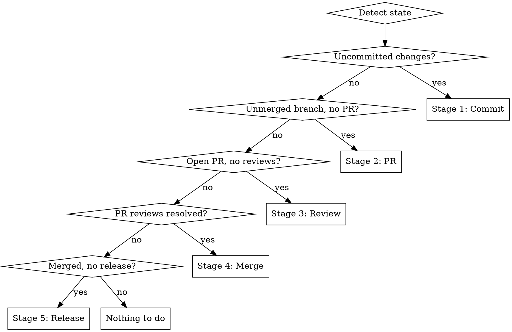

# Version Control Pipeline

## Overview

End-to-end version control workflow: micro-unit commits, PR creation, multi-role review with subagents, merge, and semver-based releases/tags.

**Core principle:** Every change flows through commit → PR → review → merge → release. Context detection picks up from wherever you are.

**Announce at start:** "Using khemoo-vc to run the version control pipeline."

## Context Detection

Before running, detect the current state and start from the appropriate stage:



**Sub-command overrides:**
- `/khemoo-vc` — full pipeline from detected state
- `/khemoo-vc commit` — Stage 1 only
- `/khemoo-vc release major|minor|patch` — Stage 5 only

## Stage 1: Micro-Unit Commit

**Rule: One concern per commit. No omnibus commits.**

1. Run `git status` and `git diff` to see all changes
2. Analyze changes and group by logical concern (single feature, single fix, single refactor)
3. For each micro-unit:
   - Stage only the files belonging to that concern
   - Write a commit message focused on WHY, not WHAT
   - Commit

**Splitting heuristic:**
- Different files touching different features → separate commits
- Test + implementation for same feature → one commit
- Formatting/lint fixes → separate commit from logic changes
- Config changes → separate from code changes

**Commit message format:**
```
<scope>: <short description of why>

<optional body explaining context>
```

Scope is flexible — use whatever best describes the concern: `docker`, `agents`, `auth`, `feat`, `fix`, `ci`, `api`, etc.

**Red flags — stop and re-split:**
- Commit touches 5+ unrelated files
- Message needs "and" to describe the change
- Mix of feature code and unrelated cleanup

## Stage 2: Create PR

1. Determine base branch (`main` or `master`)
2. Push branch: `git push -u origin <branch>`
3. Generate PR body from micro-commit messages
4. Create PR:

**PR title format:** `<Type>: <Subject>` (e.g. `Feat: Add New Button Component`)

Types: `Feat`, `Fix`, `Docs`, `Style`, `Refactor`, `Perf`, `Test`, `Build`, `Ci`, `Chore`, `Revert`

```bash
gh pr create --title "<Type>: <Subject>" --body "$(cat <<'EOF'
## Summary

<what changed and why>

## Changes

-

## How to Test

-

## Checklist

### Testing
- [ ] Tests added/updated (or N/A with reason)
- [ ] Verified manually

### Compatibility
- [ ] Breaking changes noted (if any)

### Documentation
- [ ] Docs/config updated (if needed)
EOF
)"
```

Fill in Summary, Changes, and How to Test from micro-commit messages. Report the PR URL.

## Stage 3: Multi-Role Review

Dispatch **parallel** review subagents. Each reviews the PR diff independently.

**Core reviewers (always dispatched):**

| Reviewer | Focus | Agent |
|----------|-------|-------|
| **Code Reviewer** | Logic, architecture, API contracts, backwards compatibility | `code-reviewer` (opus) |
| **Security Reviewer** | Vulnerabilities, auth, injection, trust boundaries | `security-reviewer` (sonnet) |
| **Quality Reviewer** | Naming, patterns, maintainability, anti-patterns | `quality-reviewer` (sonnet) |
| **Performance Reviewer** | Bottlenecks, memory, latency, algorithmic complexity | `quality-reviewer` (opus) |
| **Test Engineer** | Coverage gaps, missing edge cases, test quality | `test-engineer` (sonnet) |

**Specialist reviewers (dispatched when relevant changes detected):**

| Reviewer | Focus | Agent | Trigger |
|----------|-------|-------|---------|
| **UI/UX Reviewer** | Usability, interaction flow, accessibility, responsiveness | `designer` (sonnet) | Frontend components, templates, CSS, layouts |
| **Design Reviewer** | Visual consistency, design system adherence, spacing, color | `designer` (sonnet) | UI assets, style files, component styling |
| **DevOps Reviewer** | CI/CD impact, Dockerfile, deployment, infra config | `build-fixer` (sonnet) | CI configs, Dockerfiles, deploy scripts, infra |
| **Documentation Reviewer** | Docs clarity, API docs, inline comments, README | `writer` (haiku) | Docs files, README, significant public API changes |

Each reviewer produces a structured report:

```
## [Role] Review

### Issues Found
- **[severity: critical|major|minor]** <description> (file:line)

### Suggestions
- <improvement suggestion>

### Verdict: APPROVE | REQUEST_CHANGES | COMMENT
```

**Aggregate results:**
- Any `critical` issue → must fix before merge
- Any `REQUEST_CHANGES` → must address before merge
- All `APPROVE` with no critical/major → proceed to Stage 4

## Stage 4: Resolve & Merge

1. Collect all review findings from Stage 3
2. For each issue flagged:
   - Fix the issue as a new micro-unit commit (Stage 1 rules apply)
   - Push fixes to the PR branch
3. If any fixes were made, re-run Stage 3 on the new diff
4. Repeat until all reviewers return `APPROVE`
5. Merge the PR:
   - Default: merge commit (preserves micro-unit history)
   - If user prefers: squash merge

```bash
gh pr merge <pr-number> --merge --delete-branch
```

## Stage 5: Version & Release

Analyze commits since last release to determine version bump.

**Semver rules:**
| Change Type | Bump | Action |
|-------------|------|--------|
| Breaking change (API removal, behavior change) | **Major** | GitHub Release |
| New feature (additive, non-breaking) | **Minor** | GitHub Release |
| Bug fix, docs, refactor | **Patch** | Git tag only |

**Detection from commit content:**
- `BREAKING CHANGE` in commit body or scope → major
- New feature or capability added → minor
- Bug fix, docs, refactor, config, or other non-breaking change → patch

**For Major/Minor (GitHub Release):**
```bash
# Tag
git tag -a v<version> -m "Release v<version>"
git push origin v<version>

# Create release with changelog
gh release create v<version> --title "v<version>" --notes "$(cat <<'EOF'
## What's Changed
<grouped changes from commits>

**Full Changelog**: <compare URL>
EOF
)"
```

**For Patch (Tag only):**
```bash
git tag -a v<version> -m "v<version>: <summary>"
git push origin v<version>
```

**Version source:** Check for existing tags with `git tag --sort=-v:refname | head -1`. If no tags exist, start at `v0.1.0`.

## Quick Reference

| Stage | Input | Output | Agents |
|-------|-------|--------|--------|
| 1. Commit | Uncommitted changes | Micro-unit commits | — |
| 2. PR | Branch with commits | Open PR | — |
| 3. Review | Open PR | Review reports | 5 core + specialists based on changes |
| 4. Merge | Reviewed PR | Merged PR | — (re-runs Stage 3 if fixes needed) |
| 5. Release | Merged commits | Release or tag | — |

## Common Mistakes

**Omnibus commits**
- Problem: One commit with 10 unrelated changes
- Fix: Split by concern. If message needs "and", split it.

**Skipping review**
- Problem: Merge without multi-role review
- Fix: Always run all 5 core reviewers. Dispatch specialists when changes warrant them.

**Wrong version bump**
- Problem: Tagging a breaking change as patch
- Fix: Check commit messages for `BREAKING CHANGE`. When unsure, ask.

**Merging with unresolved issues**
- Problem: Critical issues ignored
- Fix: Fix-and-review loop until all `APPROVE`.

## Red Flags

**Never:**
- Commit unrelated changes together
- Merge with `REQUEST_CHANGES` unresolved
- Skip security review
- Force-push without explicit user request
- Create release without checking version history

**Always:**
- One concern per commit
- All 5 core reviewers for every PR, specialists when relevant
- Fix critical issues before merge
- Check existing tags before versioning
